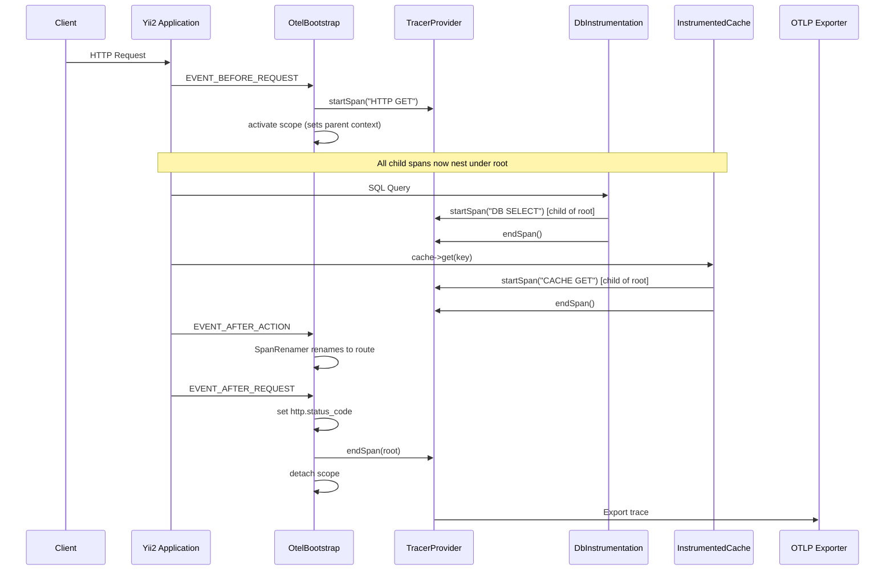

# Design Document: danvick/yii2-opentelemetry Package

## Overview

This design describes a standalone Composer package (`danvick/yii2-opentelemetry`) that provides complete OpenTelemetry instrumentation for Yii2 applications. The package extracts and improves upon the existing instrumentation in `common/components/otel/`, with one critical addition: the package **owns the root span lifecycle** by creating the root span in `EVENT_BEFORE_REQUEST` and ending it in `EVENT_AFTER_REQUEST`.

The existing `opentelemetry-auto-yii` package fails to propagate span context correctly, causing child spans (DB queries, cache operations) to appear as orphaned top-level spans in observability backends like SigNoz. By owning the root span and activating its scope, this package ensures all child spans are correctly parented.

Key differences from the existing `common/components/otel/` code:

1. **Root span lifecycle management** — `OtelBootstrap` creates and ends the root span (the core fix)
2. **Namespace** — `danvick\yii2\otel` instead of `common\components\otel`
3. **SpanAttributeProviderInterface** — replaces the hardcoded `TenantSpanAttributes` with a pluggable interface
4. **Toggleable modules** — all instrumentation modules (DB, cache, queue, views, AR, HTTP client, auth, mail, log bridge) are individually toggleable via config properties
5. **Configurable service name** — `serviceName` property or `OTEL_SERVICE_NAME` env var
6. **Configurable DB connections** — `dbConnections` array instead of hardcoded `['db', 'masterDb', 'statsDb']`
7. **No dependency on `opentelemetry-auto-yii`**
8. **Deep instrumentation modules** — optional child spans for view rendering, ActiveRecord lifecycle, outbound HTTP requests, authentication events, and mail sending (all default to off)

## Architecture

The package is a self-contained Yii2 extension installed as a sibling directory via Composer `path` repository. It hooks into the Yii2 lifecycle exclusively through events and bootstrap, requiring no modifications to application controllers, models, or jobs.

```mermaid
graph TD
    subgraph "Yii2 Application"
        APP["Application bootstrap()"]
    end

    subgraph "danvick/yii2-opentelemetry (src/)"
        BOOT["OtelBootstrap<br/>(BootstrapInterface)"]
        ROOT["Root Span Lifecycle<br/>EVENT_BEFORE_REQUEST → EVENT_AFTER_REQUEST"]
        RENAMER["SpanRenamer<br/>EVENT_AFTER_ACTION"]
        DB["DbInstrumentation<br/>Connection::EVENT_AFTER_OPEN"]
        CMD["InstrumentedCommand<br/>extends yii\db\Command"]
        CACHE["InstrumentedCache<br/>extends yii\redis\Cache"]
        QUEUE["QueueInstrumentation<br/>Queue events"]
        LOG["OtelLogTarget<br/>extends yii\log\Target"]
        VIEW["ViewInstrumentation<br/>View::EVENT_BEFORE/AFTER_RENDER"]
        AR["ArInstrumentation<br/>ActiveRecord lifecycle events"]
        HTTP_CLIENT["HttpClientInstrumentation<br/>httpclient::EVENT_BEFORE/AFTER_SEND"]
        AUTH["AuthInstrumentation<br/>User::EVENT_BEFORE/AFTER_LOGIN/LOGOUT"]
        MAIL["MailInstrumentation<br/>BaseMailer::EVENT_BEFORE/AFTER_SEND"]
        HELPERS["OtelHelpers<br/>Pure static functions"]
        SPI["SpanAttributeProviderInterface"]
    end

    subgraph "Consumer Application"
        TENANT_ATTR["TenantSpanAttributes<br/>implements SpanAttributeProviderInterface"]
    end

    subgraph "OpenTelemetry SDK"
        GLOBALS["Globals API"]
        TRACER["TracerProvider"]
        LOGGER_PROV["LoggerProvider"]
        EXPORTER["OTLP Exporter"]
    end

    subgraph "Observability Backend"
        SIGNOZ["SigNoz / Jaeger / etc."]
    end

    APP --> BOOT
    BOOT --> ROOT
    BOOT -->|instrumentDb=true| DB
    BOOT -->|instrumentCache=true| CACHE
    BOOT -->|instrumentQueue=true| QUEUE
    BOOT -->|logBridge=true| LOG
    BOOT -->|instrumentViews=true| VIEW
    BOOT -->|instrumentAr=true| AR
    BOOT -->|instrumentHttpClient=true| HTTP_CLIENT
    BOOT -->|instrumentAuth=true| AUTH
    BOOT -->|instrumentMail=true| MAIL
    BOOT --> RENAMER
    BOOT -->|spanAttributeProviders| SPI
    SPI -.->|implements| TENANT_ATTR
    DB --> CMD
    CMD --> HELPERS
    CACHE --> HELPERS
    RENAMER --> HELPERS
    QUEUE --> HELPERS
    VIEW --> HELPERS
    AR --> HELPERS
    HTTP_CLIENT --> HELPERS
    BOOT --> GLOBALS
    GLOBALS --> TRACER
    GLOBALS --> LOGGER_PROV
    TRACER --> EXPORTER
    LOGGER_PROV --> EXPORTER
    EXPORTER --> SIGNOZ
```



### Root Span Lifecycle (the core fix)



### Design Decisions

1. **Package owns the root span**: Unlike the previous approach where `opentelemetry-auto-yii` created the root span, this package creates it in `EVENT_BEFORE_REQUEST` and ends it in `EVENT_AFTER_REQUEST`. This guarantees scope activation and proper context propagation to all child spans.

2. **SpanAttributeProviderInterface for extensibility**: The hardcoded `TenantSpanAttributes` is replaced with a pluggable interface. The consuming application (Skoolite) implements this interface for tenant-specific attributes. The package remains framework-level with no app-specific knowledge.

3. **Configurable DB connections**: Instead of hardcoding `['db', 'masterDb', 'statsDb']`, the `dbConnections` config property lets consumers specify which connection component IDs to instrument.

4. **Suggest, not require**: `ext-opentelemetry`, `yiisoft/yii2-queue`, and `yiisoft/yii2-redis` are `suggest` dependencies. The package gracefully degrades when they're absent.

5. **Globals API only**: The package obtains `TracerProvider` and `LoggerProvider` from `Globals::tracerProvider()` and `Globals::loggerProvider()`. It never creates or configures its own providers — all SDK configuration is driven by standard OTEL environment variables.

6. **Console root spans via EVENT_BEFORE_ACTION/EVENT_AFTER_ACTION**: Console commands don't fire `EVENT_BEFORE_REQUEST`. Instead, the package hooks into `EVENT_BEFORE_ACTION` and `EVENT_AFTER_ACTION` for console apps.


## Components and Interfaces

### 1. OtelBootstrap

**File**: `src/OtelBootstrap.php`
**Implements**: `yii\base\BootstrapInterface`

The central entry point. Manages the root span lifecycle and registers all instrumentation sub-components.

**Configuration Properties**:

| Property | Type | Default | Description |
|---|---|---|---|
| `serviceName` | `string\|null` | `null` | Service name for the tracer scope. Falls back to `OTEL_SERVICE_NAME` env var. |
| `instrumentDb` | `bool` | `true` | Enable/disable DB query instrumentation |
| `instrumentCache` | `bool` | `true` | Enable/disable cache operation instrumentation |
| `instrumentQueue` | `bool` | `true` | Enable/disable queue job instrumentation |
| `instrumentViews` | `bool` | `false` | Enable/disable view rendering instrumentation |
| `instrumentAr` | `bool` | `false` | Enable/disable ActiveRecord lifecycle instrumentation |
| `instrumentHttpClient` | `bool` | `false` | Enable/disable HTTP client outbound request instrumentation |
| `instrumentAuth` | `bool` | `false` | Enable/disable authentication event instrumentation |
| `instrumentMail` | `bool` | `false` | Enable/disable mail sending instrumentation |
| `logBridge` | `bool` | `false` | Enable/disable Yii2 log bridge to OTEL |
| `dbConnections` | `array` | `['db']` | Yii2 connection component IDs to instrument |
| `spanAttributeProviders` | `array` | `[]` | Class names or component IDs implementing `SpanAttributeProviderInterface` |

**Lifecycle**:

```php
public function bootstrap($app): void
{
    // 1. Gate checks: extension loaded? SDK disabled?
    // 2. Resolve service name (property → env var)
    // 3. Obtain TracerProvider/LoggerProvider from Globals API
    // 4. Create Tracer with resolved service name as scope
    // 5. Register root span lifecycle (EVENT_BEFORE_REQUEST / EVENT_AFTER_REQUEST for web,
    //    EVENT_BEFORE_ACTION / EVENT_AFTER_ACTION for console)
    // 6. Register sub-components based on toggle properties
}
```

**Root Span Creation** (web — `EVENT_BEFORE_REQUEST`):
- Creates span named `HTTP {METHOD}` (e.g., `HTTP GET`, `HTTP POST`)
- Sets attributes: `http.method`, `http.url`, `http.target`, `http.scheme`, `http.host`
- Activates scope so child spans are parented
- Invokes all registered `SpanAttributeProviderInterface` implementations

**Root Span Completion** (web — `EVENT_AFTER_REQUEST`):
- Sets `http.status_code` from the response
- Ends the root span
- Detaches scope

**Root Span Creation** (console — `EVENT_BEFORE_ACTION`):
- Creates span named `console/{route}`
- Activates scope

**Root Span Completion** (console — `EVENT_AFTER_ACTION`):
- Ends the root span
- Detaches scope

**Error Handling**:
- Registers a shutdown function to catch unhandled exceptions
- On exception: records exception on root span, sets status to ERROR, ends span, detaches scope

### 2. SpanAttributeProviderInterface

**File**: `src/SpanAttributeProviderInterface.php`

```php
namespace danvick\yii2\otel;

interface SpanAttributeProviderInterface
{
    /**
     * Returns an associative array of attribute key-value pairs
     * to set on the root span.
     *
     * @return array<string, mixed>
     */
    public function getAttributes(): array;
}
```

This replaces the hardcoded `TenantSpanAttributes`. The consuming application creates a class implementing this interface (e.g., `TenantSpanAttributes implements SpanAttributeProviderInterface`) and registers it via `spanAttributeProviders` config.

### 3. SpanRenamer

**File**: `src/SpanRenamer.php`

Renames the root span to the resolved Yii2 route after action dispatch. Registered via `Application::EVENT_AFTER_ACTION`.

**Logic** (unchanged from existing implementation):
- Web with module: `{moduleId}/{controllerId}/{actionId}`
- Web without module: `{controllerId}/{actionId}`
- Console: `console/{route}`
- If no action dispatched (404): retains initial span name

### 4. DbInstrumentation

**File**: `src/DbInstrumentation.php`

Creates child spans for DB queries. Hooks into `Connection::EVENT_AFTER_OPEN` to swap `commandClass` to `InstrumentedCommand`.

**Key difference from existing code**: Uses the configurable `dbConnections` array from `OtelBootstrap` instead of hardcoded connection names. The `resolveConnectionName()` helper accepts the array of known connection IDs.

**Span attributes**: `db.system=mysql`, `db.name` (from DSN), `db.connection_name` (Yii2 component ID), `db.statement` (sanitized SQL)

### 5. InstrumentedCommand

**File**: `src/InstrumentedCommand.php`
**Extends**: `yii\db\Command`

Overrides `execute()` and `queryInternal()` to wrap DB operations with OTEL child spans. Delegates span creation to `DbInstrumentation::wrapWithSpan()`.

### 6. InstrumentedCache

**File**: `src/InstrumentedCache.php`
**Extends**: `yii\redis\Cache`

Overrides `getValue()`, `setValue()`, `deleteValue()`, and `flushValues()` to wrap cache operations with OTEL child spans.

**Span naming**: `CACHE GET`, `CACHE SET`, `CACHE DELETE`, `CACHE FLUSH`
**Attributes**: `db.system=redis`, `cache.key` (except flush), `cache.hit` (GET only)

### 7. QueueInstrumentation

**File**: `src/QueueInstrumentation.php`

Captures trace context on job push, creates linked spans on job execution.

**Hooks**:
- `Queue::EVENT_BEFORE_PUSH`: Stores `_otelTraceContext` (`trace_id`, `span_id`) on job
- `Queue::EVENT_BEFORE_EXEC`: Creates root span `JOB {shortClassName}` with optional SpanLink
- `Queue::EVENT_AFTER_EXEC`: Ends job span
- `Queue::EVENT_AFTER_ERROR`: Records exception, sets ERROR status, ends span

### 8. OtelLogTarget

**File**: `src/OtelLogTarget.php`
**Extends**: `yii\log\Target`

Forwards Yii2 log messages to the OTEL LogExporter with trace correlation.

**Log severity mapping**:
- `Logger::LEVEL_ERROR` → `ERROR`
- `Logger::LEVEL_WARNING` → `WARN`
- `Logger::LEVEL_INFO` → `INFO`
- `Logger::LEVEL_TRACE` → `DEBUG`
- `Logger::LEVEL_PROFILE` → `DEBUG`

**Attributes per log record**: `trace_id`, `span_id` (when active span exists), `log.category`

**Key difference from existing code**: No `tenant.id` resolution in the log target itself — tenant attributes come from the `SpanAttributeProviderInterface` on the root span. The log target only attaches trace context.

### 9. ViewInstrumentation

**File**: `src/ViewInstrumentation.php`

Creates child spans for view rendering operations. Hooks into `View::EVENT_BEFORE_RENDER` and `View::EVENT_AFTER_RENDER`.

**Key design**: Uses a stack (`SplStack`) to handle nested view rendering (layout → content view → partials). Each `EVENT_BEFORE_RENDER` pushes a span onto the stack, and each `EVENT_AFTER_RENDER` pops and ends the top span. This ensures correct parent-child nesting when views render other views.

**Span naming**: `VIEW {shortPath}` where `{shortPath}` is the view file path relative to the application's view directory (e.g., `tenants/index`, `layouts/main`). The short path is derived by stripping the application's `viewPath` prefix from the full file path.

**Attributes**: `view.file` (full view file path)

**Hooks**:
- `View::EVENT_BEFORE_RENDER`: Create child span `VIEW {shortPath}`, set `view.file` attribute, activate scope, push span+scope onto stack
- `View::EVENT_AFTER_RENDER`: Pop span+scope from stack, end span, detach scope

**Error handling**: If an exception occurs during rendering, the span is popped from the stack, the exception is recorded, status set to ERROR, span ended, and scope detached. Uses the active span guard to skip span creation when no valid parent span exists.

### 10. ArInstrumentation

**File**: `src/ArInstrumentation.php`

Creates child spans for ActiveRecord lifecycle operations (find, save, delete). Hooks into ActiveRecord events to wrap high-level model operations with spans, so that underlying DB query spans nest under the AR span.

**Key design**: Uses before/after event pairs to create and end spans. For save operations, hooks into `EVENT_BEFORE_INSERT`/`EVENT_AFTER_INSERT` and `EVENT_BEFORE_UPDATE`/`EVENT_AFTER_UPDATE`. For delete, hooks into `EVENT_BEFORE_DELETE`/`EVENT_AFTER_DELETE`. For find operations, wraps `ActiveQuery` methods (`all()`, `one()`, `each()`) by hooking into `ActiveRecord::EVENT_AFTER_FIND` combined with a custom `InstrumentedActiveQuery` or by wrapping the query execution.

**Span naming**:
- `AR FIND {ModelShortName}` (e.g., `AR FIND Tenant`, `AR FIND Student`)
- `AR SAVE {ModelShortName}` (e.g., `AR SAVE Tenant`)
- `AR DELETE {ModelShortName}` (e.g., `AR DELETE Student`)

**Attributes**:
- `ar.model`: Short class name of the ActiveRecord model (via `OtelHelpers::shortClassName()`)
- `ar.operation`: Operation type (`find`, `save`, `delete`)
- `ar.is_new`: `true` for inserts, `false` for updates (save operations only)

**Nesting**: Because the AR span is activated before the underlying DB queries execute, the DB child spans created by `DbInstrumentation` automatically nest under the AR span via OTEL context propagation.

**Error handling**: Same pattern as other modules — record exception, set ERROR status, end span, detach scope. Uses the active span guard.

### 11. HttpClientInstrumentation

**File**: `src/HttpClientInstrumentation.php`

Creates child spans for outbound HTTP requests made via `yii\httpclient\Client`. Hooks into `Client::EVENT_BEFORE_SEND` and `Client::EVENT_AFTER_SEND`.

**Span naming**: `HTTP {METHOD} {host}` (e.g., `HTTP POST api.jumbefupi.com`, `HTTP GET chatwoot.example.com`). The host is extracted from the request URL using `parse_url()`.

**Span kind**: `SpanKind::KIND_CLIENT` (outbound request)

**Attributes**:
- `http.method`: Request method (GET, POST, etc.)
- `http.url`: Full request URL
- `http.host`: Target hostname extracted from URL
- `http.status_code`: Response status code (set after response in `EVENT_AFTER_SEND`)

**Hooks**:
- `Client::EVENT_BEFORE_SEND`: Create child span, set method/url/host attributes, activate scope
- `Client::EVENT_AFTER_SEND`: Set `http.status_code`, end span, detach scope

**Error handling**: If the request fails with a transport error (connection refused, timeout), the exception is recorded on the span, status set to ERROR, span ended, scope detached. Uses the active span guard.

### 12. AuthInstrumentation

**File**: `src/AuthInstrumentation.php`

Creates child spans for authentication events (login, logout). Hooks into `yii\web\User` events.

**Span naming**:
- `AUTH LOGIN` for login attempts
- `AUTH LOGOUT` for logout attempts

**Attributes**:
- `auth.user_id`: User ID from the identity (when available)
- `auth.success`: `true` on successful login (set in `EVENT_AFTER_LOGIN`)

**Hooks**:
- `User::EVENT_BEFORE_LOGIN`: Create child span `AUTH LOGIN`, set `auth.user_id` if identity available, activate scope
- `User::EVENT_AFTER_LOGIN`: Set `auth.success` to `true`, end span, detach scope
- `User::EVENT_BEFORE_LOGOUT`: Create child span `AUTH LOGOUT`, set `auth.user_id` if identity available, activate scope
- `User::EVENT_AFTER_LOGOUT`: End span, detach scope

**Error handling**: Uses the active span guard. If an exception occurs between before/after events, the shutdown handler or error handler will clean up the span.

### 13. MailInstrumentation

**File**: `src/MailInstrumentation.php`

Creates child spans for mail sending operations. Hooks into `yii\mail\BaseMailer::EVENT_BEFORE_SEND` and `EVENT_AFTER_SEND`.

**Span naming**: `MAIL SEND`

**Attributes**:
- `mail.to`: Recipient address(es) (comma-separated if multiple)
- `mail.subject`: Message subject
- `mail.success`: `true` if sent successfully, `false` otherwise (set in `EVENT_AFTER_SEND`)

**Hooks**:
- `BaseMailer::EVENT_BEFORE_SEND`: Create child span `MAIL SEND`, set `mail.to` and `mail.subject` from the message, activate scope
- `BaseMailer::EVENT_AFTER_SEND`: Set `mail.success` from `$event->isSuccessful`, end span, detach scope

**Error handling**: If mail sending throws an exception, the exception is recorded on the span, status set to ERROR, span ended, scope detached. Uses the active span guard.

### 14. OtelHelpers

**File**: `src/OtelHelpers.php`

Pure static helper functions (stateless, side-effect-free):

| Method | Purpose |
|---|---|
| `buildRouteName(?string $moduleId, string $controllerId, string $actionId): string` | Web route span name |
| `buildConsoleRouteName(string $route): string` | Console route span name |
| `extractSqlVerb(string $sql): string` | First word of SQL, uppercased |
| `sanitizeSql(string $sql, array $params): string` | Replace bound params with `?` |
| `extractDbNameFromDsn(string $dsn): string` | Extract `dbname` from MySQL DSN |
| `resolveConnectionName(Connection $conn, array $knownConnections): string` | Match connection to component ID |
| `mapYiiLogLevel(int $level): string` | Yii2 log level → OTEL severity string |
| `shortClassName(string $fqcn): string` | Last segment after `\` |
| `hasActiveSpan(): bool` | Check if current span context is valid |


## Data Models

### Package Directory Structure

```
yii2-opentelemetry/
├── src/
│   ├── OtelBootstrap.php                  # Central bootstrap + root span lifecycle
│   ├── SpanRenamer.php                    # Route-aware span renaming
│   ├── DbInstrumentation.php              # DB query child spans
│   ├── InstrumentedCommand.php            # yii\db\Command subclass
│   ├── InstrumentedCache.php              # yii\redis\Cache subclass
│   ├── QueueInstrumentation.php           # Queue job span links
│   ├── OtelLogTarget.php                  # Yii2 log → OTEL log bridge
│   ├── ViewInstrumentation.php            # View rendering child spans
│   ├── ArInstrumentation.php              # ActiveRecord lifecycle child spans
│   ├── HttpClientInstrumentation.php      # HTTP client outbound request child spans
│   ├── AuthInstrumentation.php            # Authentication event child spans
│   ├── MailInstrumentation.php            # Mail sending child spans
│   ├── OtelHelpers.php                    # Pure helper functions
│   └── SpanAttributeProviderInterface.php # Extensibility interface
├── tests/
│   └── unit/
│       ├── OtelHelpersTest.php
│       ├── SpanRenamerTest.php
│       ├── DbInstrumentationTest.php
│       ├── InstrumentedCacheTest.php
│       ├── QueueInstrumentationTest.php
│       ├── OtelLogTargetTest.php
│       ├── OtelBootstrapTest.php
│       ├── ViewInstrumentationTest.php
│       ├── ArInstrumentationTest.php
│       ├── HttpClientInstrumentationTest.php
│       ├── AuthInstrumentationTest.php
│       └── MailInstrumentationTest.php
├── composer.json
├── README.md
└── LICENSE
```

### composer.json

```json
{
    "name": "danvick/yii2-opentelemetry",
    "description": "OpenTelemetry instrumentation for Yii2 applications",
    "type": "yii2-extension",
    "license": "MIT",
    "autoload": {
        "psr-4": {
            "danvick\\yii2\\otel\\": "src/"
        }
    },
    "autoload-dev": {
        "psr-4": {
            "danvick\\yii2\\otel\\tests\\": "tests/"
        }
    },
    "require": {
        "php": ">=8.0",
        "yiisoft/yii2": ">=2.0.16 <2.1.0",
        "open-telemetry/sdk": "^1.0 || 2.x-dev"
    },
    "suggest": {
        "ext-opentelemetry": "Required for auto-instrumentation and context propagation",
        "yiisoft/yii2-queue": "Required for queue job instrumentation",
        "yiisoft/yii2-redis": "Required for cache instrumentation with InstrumentedCache",
        "yiisoft/yii2-httpclient": "Required for HTTP client outbound request instrumentation"
    }
}
```

### Consumer Integration (Skoolite composer.json changes)

```json
{
    "repositories": [
        {
            "type": "path",
            "url": "../yii2-opentelemetry"
        }
    ],
    "require": {
        "danvick/yii2-opentelemetry": "@dev"
    }
}
```

Remove `open-telemetry/opentelemetry-auto-yii` from `require`.

### Consumer Bootstrap Configuration

```php
// common/config/main.php
'bootstrap' => [
    Bootstrap::class,
    [
        'class' => \danvick\yii2\otel\OtelBootstrap::class,
        'serviceName' => 'skoolite-backend',  // or use OTEL_SERVICE_NAME env var
        'instrumentDb' => true,
        'instrumentCache' => true,
        'instrumentQueue' => true,
        'instrumentViews' => false,
        'instrumentAr' => false,
        'instrumentHttpClient' => false,
        'instrumentAuth' => false,
        'instrumentMail' => false,
        'logBridge' => false,
        'dbConnections' => ['db', 'masterDb', 'statsDb'],
        'spanAttributeProviders' => [
            \common\components\otel\TenantSpanAttributes::class,
        ],
    ],
],
```

### Span Attribute Schema

| Attribute | Type | Source | Applied To |
|---|---|---|---|
| `http.method` | string | `$_SERVER['REQUEST_METHOD']` | Root span (web) |
| `http.url` | string | Full request URL | Root span (web) |
| `http.target` | string | Request URI path + query | Root span (web) |
| `http.scheme` | string | `http` or `https` | Root span (web) |
| `http.host` | string | `$_SERVER['HTTP_HOST']` | Root span (web) |
| `http.status_code` | int | Response status code | Root span (web, set on end) |
| `db.system` | string | `mysql` (hardcoded) | DB child spans |
| `db.name` | string | Extracted from connection DSN | DB child spans |
| `db.connection_name` | string | Yii2 component ID | DB child spans |
| `db.statement` | string | Sanitized SQL (params → `?`) | DB child spans |
| `db.system` (cache) | string | `redis` (hardcoded) | Cache child spans |
| `cache.key` | string | Cache method argument | Cache child spans (except flush) |
| `cache.hit` | boolean | GET return value check | Cache GET spans |
| `view.file` | string | Full view file path | View child spans |
| `ar.model` | string | Short class name of AR model | AR child spans |
| `ar.operation` | string | `find`, `save`, or `delete` | AR child spans |
| `ar.is_new` | boolean | `isNewRecord` on save | AR SAVE child spans |
| `http.method` (client) | string | Request method | HTTP client child spans |
| `http.url` (client) | string | Full request URL | HTTP client child spans |
| `http.host` (client) | string | Target hostname from URL | HTTP client child spans |
| `http.status_code` (client) | int | Response status code | HTTP client child spans (set on end) |
| `auth.user_id` | string | User identity ID | Auth child spans |
| `auth.success` | boolean | Login success flag | AUTH LOGIN child spans (set on end) |
| `mail.to` | string | Recipient address(es) | Mail child spans |
| `mail.subject` | string | Message subject | Mail child spans |
| `mail.success` | boolean | Send success flag | Mail child spans (set on end) |
| `log.category` | string | Yii2 log category | Log records |
| `trace_id` | string | Active span context | Log records |
| `span_id` | string | Active span context | Log records |

### Span Naming Convention

| Context | Pattern | Example |
|---|---|---|
| Web request initial | `HTTP {METHOD}` | `HTTP GET`, `HTTP POST` |
| Web request renamed | `{moduleId}/{controllerId}/{actionId}` | `academics/exams/index` |
| Web request (no module) | `{controllerId}/{actionId}` | `tenants/view` |
| Console command | `console/{route}` | `console/migrate/up` |
| DB query | `DB {VERB}` | `DB SELECT`, `DB INSERT` |
| Cache operation | `CACHE {OP}` | `CACHE GET`, `CACHE SET` |
| Queue job | `JOB {shortClassName}` | `JOB ExamClassRankingJob` |
| View rendering | `VIEW {shortPath}` | `VIEW tenants/index`, `VIEW layouts/main` |
| ActiveRecord find | `AR FIND {ModelShortName}` | `AR FIND Tenant`, `AR FIND Student` |
| ActiveRecord save | `AR SAVE {ModelShortName}` | `AR SAVE Tenant` |
| ActiveRecord delete | `AR DELETE {ModelShortName}` | `AR DELETE Student` |
| HTTP client outbound | `HTTP {METHOD} {host}` | `HTTP POST api.jumbefupi.com` |
| Authentication login | `AUTH LOGIN` | `AUTH LOGIN` |
| Authentication logout | `AUTH LOGOUT` | `AUTH LOGOUT` |
| Mail sending | `MAIL SEND` | `MAIL SEND` |

### Queue Job Trace Context Payload

```php
// Stored as property on job object before serialization
$job->_otelTraceContext = [
    'trace_id' => '4bf92f3577b34da6a3ce929d0e0e4736',
    'span_id' => '00f067aa0ba902b7',
];
```

### Log Severity Mapping

| Yii2 Level | OTEL Severity Text | OTEL Severity Number |
|---|---|---|
| `Logger::LEVEL_ERROR` | `ERROR` | `Severity::ERROR` |
| `Logger::LEVEL_WARNING` | `WARN` | `Severity::WARN` |
| `Logger::LEVEL_INFO` | `INFO` | `Severity::INFO` |
| `Logger::LEVEL_TRACE` | `DEBUG` | `Severity::DEBUG` |
| `Logger::LEVEL_PROFILE` | `DEBUG` | `Severity::DEBUG` |

### Environment Variables (consumed by OTEL SDK, not by the package)

| Variable | Purpose |
|---|---|
| `OTEL_SERVICE_NAME` | Fallback service name when `serviceName` property not set |
| `OTEL_EXPORTER_OTLP_ENDPOINT` | Collector endpoint |
| `OTEL_EXPORTER_OTLP_PROTOCOL` | Export protocol (`http/protobuf`) |
| `OTEL_TRACES_EXPORTER` | Traces exporter (`otlp`) |
| `OTEL_TRACES_SAMPLER` | Sampler type |
| `OTEL_TRACES_SAMPLER_ARG` | Sampling rate |
| `OTEL_LOGS_EXPORTER` | Log exporter (`otlp` to enable log bridge) |
| `OTEL_SDK_DISABLED` | Kill switch for all instrumentation |


## Correctness Properties

*A property is a characteristic or behavior that should hold true across all valid executions of a system — essentially, a formal statement about what the system should do. Properties serve as the bridge between human-readable specifications and machine-verifiable correctness guarantees.*

### Property 1: Route-to-span-name produces correct format

*For any* combination of optional module ID (nullable string), controller ID (non-empty string), and action ID (non-empty string), the `buildRouteName` function shall produce `{moduleId}/{controllerId}/{actionId}` when moduleId is non-null, or `{controllerId}/{actionId}` when moduleId is null. For any console route string, `buildConsoleRouteName` shall produce `console/{route}`. In all cases, the output shall contain all non-null input segments separated by `/`.

**Validates: Requirements 2.3, 5.1, 5.2, 5.3**

### Property 2: SQL verb extraction and DB span naming

*For any* SQL statement string starting with a known SQL verb (SELECT, INSERT, UPDATE, DELETE, SHOW, ALTER, CREATE, DROP, etc.), the `extractSqlVerb` function shall return the uppercase first word of the statement, and the resulting DB span name `DB {verb}` shall equal `DB` followed by a space and the uppercase verb.

**Validates: Requirements 6.2, 15.1, 15.2, 15.3**

### Property 3: SQL parameter sanitization round-trip safety

*For any* SQL string containing named parameter placeholders (`:param0`, `:param1`, etc.) and an associative array of parameter key-value pairs, the `sanitizeSql` function shall replace all parameter keys with `?` placeholders. The output shall contain no original parameter keys, and when parameters include keys where one is a prefix of another (e.g., `:param1` and `:param10`), the longer key shall be replaced first to prevent partial matches.

**Validates: Requirements 6.6, 13.1, 13.2**

### Property 4: DSN database name extraction

*For any* MySQL DSN string in the format `mysql:host={host};port={port};dbname={name}` (where parameter order may vary), the `extractDbNameFromDsn` function shall return the exact `{name}` value. When the DSN does not contain a `dbname` parameter, the function shall return an empty string.

**Validates: Requirements 6.4, 14.1**

### Property 5: Short class name extraction and job span naming

*For any* fully-qualified PHP class name containing one or more `\` namespace separators, the `shortClassName` function shall return the last segment after the final `\`. When the class name has no `\` separator, the function shall return the full string unchanged. The resulting job span name shall equal `JOB {shortClassName}`.

**Validates: Requirements 9.2, 16.1, 16.3**

### Property 6: Cache operation span naming

*For any* cache operation type in the set {`get`, `set`, `delete`, `flush`}, the resulting span name shall equal `CACHE {OPERATION}` where `{OPERATION}` is the uppercase operation type (i.e., `CACHE GET`, `CACHE SET`, `CACHE DELETE`, `CACHE FLUSH`).

**Validates: Requirements 7.1, 7.3**

### Property 7: Cache hit/miss attribute correctness

*For any* cache GET operation, the `cache.hit` span attribute shall be `true` if and only if the underlying cache returned a value (not `false`), and `false` when the cache returned a miss (`false`).

**Validates: Requirements 7.2**

### Property 8: Cache span required attributes invariant

*For any* cache child span for operations `get`, `set`, or `delete`, the span shall contain `db.system` set to `redis` and `cache.key` set to the exact key string passed to the operation. For `flush` operations, the span shall contain `db.system` set to `redis` but shall not contain a `cache.key` attribute.

**Validates: Requirements 7.4, 7.5**

### Property 9: Log level mapping correctness

*For any* Yii2 log level in the set {`Logger::LEVEL_ERROR`, `Logger::LEVEL_WARNING`, `Logger::LEVEL_INFO`, `Logger::LEVEL_TRACE`, `Logger::LEVEL_PROFILE`}, the `mapYiiLogLevel` function shall return the corresponding OTEL severity string: `ERROR`, `WARN`, `INFO`, `DEBUG`, `DEBUG` respectively. The mapping shall be total over the known domain.

**Validates: Requirements 10.3**

### Property 10: Log record trace context and category attributes

*For any* log message emitted within an active trace (valid span context), the resulting OTEL log record shall contain `trace_id` and `span_id` matching the active span's context, and `log.category` matching the Yii2 log category string. When no active trace exists, `trace_id` and `span_id` shall not be attached.

**Validates: Requirements 10.2, 10.4**

### Property 11: Queue trace context round-trip

*For any* job pushed within an active trace, the `_otelTraceContext` property stored on the job shall contain `trace_id` and `span_id` matching the active span at push time. When that job is later executed and the `_otelTraceContext` is present, the created job span shall contain a SpanLink whose `trace_id` and `span_id` match the stored values.

**Validates: Requirements 9.1, 9.3**

### Property 12: HTTP semantic attributes on root span

*For any* web request with a valid HTTP method, URL, target path, scheme, and host, the root span created by OtelBootstrap shall contain all of: `http.method` (matching the request method), `http.url` (matching the full URL), `http.target` (matching the URI path + query), `http.scheme` (matching the protocol), and `http.host` (matching the host header). After the response is sent, `http.status_code` shall be set to the response status code.

**Validates: Requirements 2.6**

### Property 13: Span attribute providers invocation

*For any* set of registered `SpanAttributeProviderInterface` implementations, when a root span is created, the OtelBootstrap shall invoke `getAttributes()` on each provider and set all returned key-value pairs as attributes on the root span. The union of all provider attributes shall be present on the span.

**Validates: Requirements 8.3**

### Property 14: View span naming and attributes

*For any* view file path, the `ViewInstrumentation` shall create a child span named `VIEW {shortPath}` where `{shortPath}` is the view file path relative to the application's view directory, and shall set the `view.file` attribute to the full view file path. The short path shall be derived by stripping the application's `viewPath` prefix from the full path.

**Validates: Requirements 18.1, 18.3**

### Property 15: Nested view span stacking

*For any* sequence of nested view render events (e.g., layout rendering a content view, content view rendering partials), the `ViewInstrumentation` shall produce a correct parent-child hierarchy of view spans. Specifically, for any sequence of N `EVENT_BEFORE_RENDER` events followed by their corresponding N `EVENT_AFTER_RENDER` events in LIFO order, the resulting spans shall form a stack where each inner view span is a child of the outer view span.

**Validates: Requirements 18.4**

### Property 16: AR operation span naming and attributes

*For any* ActiveRecord operation (find, save, or delete) on any model class, the `ArInstrumentation` shall create a child span named `AR {OPERATION} {ModelShortName}` where `{OPERATION}` is `FIND`, `SAVE`, or `DELETE` (uppercase) and `{ModelShortName}` is the short class name. The span shall contain `ar.model` set to the short class name and `ar.operation` set to the lowercase operation type (`find`, `save`, `delete`).

**Validates: Requirements 19.1, 19.2, 19.3, 19.4, 19.5**

### Property 17: AR save is_new attribute correctness

*For any* ActiveRecord save operation, the `ar.is_new` span attribute shall be `true` if and only if the record's `isNewRecord` property is `true` (insert), and `false` when `isNewRecord` is `false` (update).

**Validates: Requirements 19.6**

### Property 18: HTTP client outbound span naming and attributes

*For any* outbound HTTP request with a valid method and URL, the `HttpClientInstrumentation` shall create a child span named `HTTP {METHOD} {host}` where `{host}` is extracted from the request URL via `parse_url()`. The span kind shall be `KIND_CLIENT`, and the span shall contain `http.method`, `http.url`, and `http.host` attributes. After the response is received, `http.status_code` shall be set to the response status code.

**Validates: Requirements 20.1, 20.3, 20.4**

### Property 19: Mail span required attributes

*For any* mail send operation with a message containing recipient address(es) and a subject, the `MailInstrumentation` shall create a child span named `MAIL SEND` with `mail.to` set to the recipient address(es) and `mail.subject` set to the message subject. After sending completes, `mail.success` shall be set to `true` if the message was sent successfully, `false` otherwise.

**Validates: Requirements 22.1, 22.2, 22.3, 22.4**


## Error Handling

### Extension Not Loaded
When `extension_loaded('opentelemetry')` returns `false`, `OtelBootstrap::bootstrap()` returns immediately without registering any event handlers, creating any spans, or swapping any components. Zero overhead.

### SDK Disabled
When `OTEL_SDK_DISABLED=true`, the bootstrap checks this env var and returns early. The OTEL SDK itself also respects this flag and produces no-op tracers/loggers.

### Collector Unreachable
The package delegates all export error handling to the OTEL SDK. The SDK's OTLP exporter handles transport errors internally — it logs failures and drops spans/logs rather than throwing exceptions. The package does not implement custom retry or fallback logic.

### SpanAttributeProvider Exceptions
If a registered `SpanAttributeProviderInterface` implementation throws an exception during `getAttributes()`, the `OtelBootstrap` catches the exception, logs it via `Yii::warning()`, and continues processing the remaining providers. The root span is not affected — it simply lacks the attributes from the failing provider.

### DB Query Span Errors
When a DB query throws an exception, `DbInstrumentation::wrapWithSpan()` catches it, records the exception on the span via `$span->recordException($e)`, sets span status to `StatusCode::STATUS_ERROR`, ends the span, detaches the scope, and re-throws the original exception unmodified.

### Cache Span Errors
If the underlying Redis connection fails during a cache operation, `InstrumentedCache` catches the exception, records it on the span, ends the span, detaches the scope, and re-throws. Cache failures are never masked by instrumentation.

### Queue Job Span Errors
When `Queue::EVENT_AFTER_ERROR` fires, `QueueInstrumentation` records the exception on the job span and sets error status. If `_otelTraceContext` is malformed or missing, the handler creates the span without a link (no exception thrown).

### Root Span Error Handling
If an unhandled exception occurs during request processing, the `OtelBootstrap` registers an error handler (via `register_shutdown_function` or Yii2's error handler event) that records the exception on the root span, sets status to ERROR, ends the span, and detaches the scope. This ensures the root span is always properly closed even on fatal errors.

### View Span Errors
If an exception occurs during view rendering, `ViewInstrumentation` pops the current span from the stack, records the exception via `$span->recordException($e)`, sets span status to `StatusCode::STATUS_ERROR`, ends the span, and detaches the scope. The stack-based design ensures that even with nested views, only the innermost failing span is affected — outer view spans are ended normally by their corresponding `EVENT_AFTER_RENDER` handlers.

### ActiveRecord Span Errors
If an exception occurs during an AR operation (find, save, delete), `ArInstrumentation` records the exception on the AR span, sets error status, ends the span, and detaches the scope. The underlying DB query spans (created by `DbInstrumentation`) handle their own errors independently — an AR span error does not prevent DB spans from being properly closed.

### HTTP Client Span Errors
If an outbound HTTP request fails with a transport error (connection refused, timeout, DNS failure), `HttpClientInstrumentation` records the exception on the span, sets error status, ends the span, and detaches the scope. The `http.status_code` attribute is not set when no response is received.

### Auth Span Errors
Authentication spans are lightweight (login/logout events). If an exception occurs between `EVENT_BEFORE_LOGIN` and `EVENT_AFTER_LOGIN`, the span may remain open until the root span's error handler or shutdown function cleans up the context.

### Mail Span Errors
If mail sending throws an exception, `MailInstrumentation` records the exception on the span, sets error status, ends the span, and detaches the scope. The `mail.success` attribute is not set when an exception prevents normal completion.

### Scope Detachment
All span scopes are detached in `finally` blocks to prevent context leaks. The root span scope is detached in `EVENT_AFTER_REQUEST` (web) or `EVENT_AFTER_ACTION` (console), and also in the error handler as a safety net.

## Testing Strategy

### Property-Based Testing

**Library**: [phpunit/phpunit](https://phpunit.de/) with a lightweight custom generator approach for property-based tests. Each property test runs a minimum of 100 iterations with randomly generated inputs. If a dedicated PHP PBT library like `innmind/black-box` is available, prefer it.

**Configuration**:
- Minimum 100 iterations per property test
- Each test tagged with a comment referencing the design property
- Tag format: `Feature: yii2-opentelemetry-package, Property {number}: {property_text}`

### Pure Function Properties (unit-testable without Yii2 app context)

These test the stateless helper functions in `OtelHelpers`:

- **Property 1** (route naming): Generate random strings for moduleId (nullable), controllerId, actionId. Verify output format matches `{moduleId}/{controllerId}/{actionId}` or `{controllerId}/{actionId}`. Generate random console routes and verify `console/{route}` format.
- **Property 2** (SQL verb extraction): Generate random SQL statements starting with known verbs (SELECT, INSERT, UPDATE, DELETE, SHOW, etc.) followed by random content. Verify `extractSqlVerb` returns the uppercase first word.
- **Property 3** (SQL sanitization): Generate SQL strings with random named parameters (`:param0` through `:paramN`) and random values. Verify all parameter keys are replaced with `?` and no original keys remain. Include cases where one key is a prefix of another.
- **Property 4** (DSN extraction): Generate MySQL DSN strings with random host, port, and dbname values in varying parameter orders. Verify `extractDbNameFromDsn` returns the correct dbname.
- **Property 5** (short class name): Generate random fully-qualified class names with 1-5 namespace segments. Verify `shortClassName` returns the last segment. Also test names without `\`.
- **Property 6** (cache span naming): For each operation in {get, set, delete, flush}, verify the span name matches `CACHE {OPERATION}`.
- **Property 9** (log level mapping): For each Yii2 log level, verify the mapping returns the correct OTEL severity string.

### Integration Properties (require mocked Yii2 app or OTEL SDK)

These test component behavior with mocked dependencies:

- **Property 7** (cache hit/miss): Mock `InstrumentedCache` with known keys. Verify `cache.hit` is `true` for hits and `false` for misses.
- **Property 8** (cache span attributes): Mock cache operations. Verify `db.system=redis` and `cache.key` presence/absence.
- **Property 10** (log record attributes): Mock active trace context. Verify log records contain `trace_id`, `span_id`, and `log.category`.
- **Property 11** (queue trace context round-trip): Mock queue push/exec cycle. Verify `_otelTraceContext` is captured on push and SpanLink is created on exec.
- **Property 12** (HTTP attributes): Mock HTTP request data. Verify all semantic convention attributes are set on the root span.
- **Property 13** (span attribute providers): Create mock providers returning random attributes. Verify all attributes are set on the root span.
- **Property 14** (view span naming): Mock `View` render events with random view file paths. Verify span name matches `VIEW {shortPath}` and `view.file` attribute contains the full path.
- **Property 15** (nested view stacking): Simulate nested render event sequences (before/before/.../after/after in LIFO order). Verify spans form correct parent-child hierarchy.
- **Property 16** (AR span naming): Mock ActiveRecord events for find/save/delete on random model classes. Verify span name matches `AR {OP} {ShortName}` and `ar.model`/`ar.operation` attributes are correct.
- **Property 17** (AR save is_new): Mock AR save events with random `isNewRecord` states. Verify `ar.is_new` attribute matches the record state.
- **Property 18** (HTTP client spans): Mock `yii\httpclient\Client` send events with random methods and URLs. Verify span name matches `HTTP {METHOD} {host}`, kind is `KIND_CLIENT`, and attributes are set.
- **Property 19** (mail span attributes): Mock `BaseMailer` send events with random recipients and subjects. Verify `mail.to`, `mail.subject`, and `mail.success` attributes are set correctly.

### Unit Tests (specific examples and edge cases)

Unit tests complement property tests by covering specific scenarios:

- **Route naming edge cases**: 404 before dispatch (span name unchanged), empty strings, deeply nested module routes
- **SQL sanitization edge cases**: Empty SQL, SQL with no parameters (identity), SQL with `?` already in string literals, parameters with special regex characters
- **DSN extraction edge cases**: DSN without `dbname`, DSN with socket path, DSN with only host
- **Graceful degradation**: Extension not loaded → no exceptions, `OTEL_SDK_DISABLED=true` → no spans created, no event handlers registered
- **Toggle behavior**: `instrumentDb=false` → no DB event handlers, `instrumentCache=false` → cache component not swapped, `instrumentQueue=false` → no queue event handlers, `logBridge=false` → no log target registered
- **SpanAttributeProvider error handling**: Provider throws exception → logged, other providers still invoked
- **Active span guard**: No active span → DB/cache operations skip span creation, return results directly
- **Queue backward compatibility**: Job without `_otelTraceContext` → span created without link
- **Root span error handling**: Unhandled exception → span recorded with error, ended, scope detached
- **Service name resolution**: `serviceName` property takes precedence over `OTEL_SERVICE_NAME` env var
- **View rendering edge cases**: Deeply nested views (layout → content → partial → partial), exception during nested render (inner span cleaned up, outer spans still valid), view rendered outside request context (active span guard skips)
- **AR instrumentation edge cases**: Save on new record (`ar.is_new=true`) vs existing record (`ar.is_new=false`), exception during save (AR span gets error, DB spans unaffected), AR operation outside request context (active span guard skips)
- **HTTP client edge cases**: Request with no response (transport error), URL with no host (fallback handling), request outside request context (active span guard skips)
- **Auth edge cases**: Login/logout without user identity (no `auth.user_id` attribute), auth events outside request context (active span guard skips)
- **Mail edge cases**: Mail with multiple recipients (comma-separated `mail.to`), mail send failure (`mail.success=false`), exception during send (span gets error), mail outside request context (active span guard skips)
- **New toggle behavior**: `instrumentViews=false` → no view event handlers, `instrumentAr=false` → no AR event handlers, `instrumentHttpClient=false` → no HTTP client event handlers, `instrumentAuth=false` → no auth event handlers, `instrumentMail=false` → no mail event handlers

### Test File Organization

```
tests/unit/
├── OtelHelpersTest.php            # Properties 1-5, 9 + edge cases
├── SpanRenamerTest.php            # Property 1 integration + edge cases
├── DbInstrumentationTest.php      # Properties 2, 3, 4 integration + edge cases
├── InstrumentedCacheTest.php      # Properties 6, 7, 8 + edge cases
├── QueueInstrumentationTest.php   # Properties 5, 11 + edge cases
├── OtelLogTargetTest.php          # Properties 9, 10 + edge cases
├── OtelBootstrapTest.php          # Properties 12, 13 + graceful degradation + toggles
├── ViewInstrumentationTest.php    # Properties 14, 15 + nested view edge cases
├── ArInstrumentationTest.php      # Properties 16, 17 + save/find/delete edge cases
├── HttpClientInstrumentationTest.php  # Property 18 + transport error edge cases
├── AuthInstrumentationTest.php    # Auth login/logout examples + edge cases
└── MailInstrumentationTest.php    # Property 19 + send failure edge cases
```

### Test Dependencies

- PHPUnit (via Codeception or standalone)
- Mock objects for OTEL SDK interfaces (`TracerInterface`, `SpanInterface`, `SpanBuilderInterface`, `LoggerInterface`)
- No real OTEL collector needed — all tests use in-memory mocks

